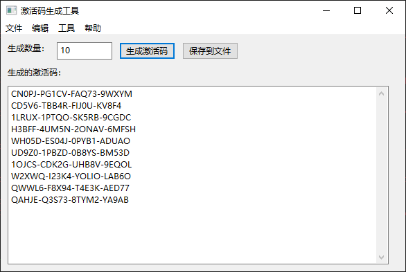
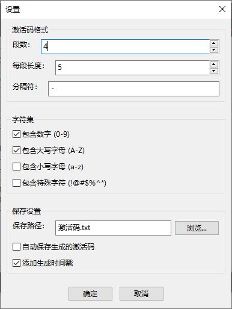
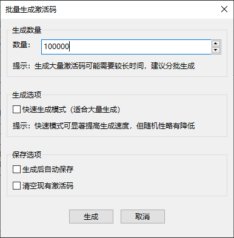

# 激活码生成工具

一个功能强大、界面友好的激活码生成工具，支持批量生成、自定义格式、查重等功能。

## 功能特性

- 🎯 **灵活的激活码格式**：可自定义段数、每段长度、分隔符
- 📦 **批量生成**：支持生成1-100,000个激活码，包含快速生成模式
- 🔍 **重复检测**：自动检测并提示重复的激活码
- 💾 **智能保存**：支持保存到文件、另存为、自动保存
- 🎨 **友好的图形界面**：基于wxPython的现代GUI
- 🔧 **丰富的设置选项**：可自定义字符集、保存路径等
- ⚡ **快速生成模式**：优化大批量激活码生成速度

## 安装说明

### 环境要求

- Python 3.6+
- wxPython

### 安装步骤

1. **克隆项目**

```bash
git clone https://github.com/zhangleyan0413/activation-code-generator.git
cd activation-code-generator
```

2. **安装依赖**

```bash
pip install wxPython
```

3. **运行程序**

```bash
# Windows
run.bat

# 或直接运行
python main.py
```

## 使用方法

### 基本使用

1. **生成激活码**
   - 在主界面输入要生成的激活码数量
   - 点击「生成激活码」按钮
   - 生成的激活码会显示在下方文本框中

2. **保存激活码**
   - 点击「保存到文件」按钮
   - 激活码会保存到 `激活码.txt` 文件中

### 高级功能

1. **批量生成**
   - 通过菜单「工具 → 批量生成...」打开批量生成对话框
   - 设置生成数量（最多100,000个）
   - 选择是否使用快速生成模式
   - 点击「生成」按钮

2. **自定义设置**
   - 通过菜单「工具 → 设置...」打开设置对话框
   - 自定义激活码格式、字符集、保存路径等
   - 点击「确定」保存设置

3. **另存为**
   - 通过菜单「文件 → 另存为...」打开另存为对话框
   - 选择保存路径和文件名
   - 点击「保存」按钮

4. **打开文件**
   - 通过菜单「文件 → 打开...」打开激活码文件
   - 程序会自动检测文件中的重复激活码

## 界面预览







## 激活码格式

默认格式：`XXXXX-XXXXX-XXXXX-XXXXX`

- 每段5个字符
- 使用 `-` 作为分隔符
- 包含数字和大写字母

可通过设置自定义格式，支持：
- 1-10段激活码
- 每段1-10个字符
- 自定义分隔符
- 可选字符集（数字、大小写字母、特殊字符）

## 保存格式

激活码会保存为以下格式：

```
生成时间：2026-02-20 12:00:00
生成个数：10
ABCDE-12345-FGHIJ-KLMNO
PQRST-67890-UVWXY-ZABCD
...
--------------------------------------------------
```

## 贡献指南

欢迎贡献代码和提出问题！

1. Fork 本项目
2. 创建特性分支 (`git checkout -b feature/amazing-feature`)
3. 提交更改 (`git commit -m 'Add some amazing feature'`)
4. 推送到分支 (`git push origin feature/amazing-feature`)
5. 打开 Pull Request

## 许可证

本项目采用 MIT 许可证 - 详情见 [LICENSE](LICENSE) 文件

## 联系方式

- 作者：myiunagn
- 邮箱：myiunagn@outlook.com
- 项目链接：https://github.com/zhangleyan0413/activation-code-generator

## 更新日志

### v1.0.2
- ✨ 添加快速生成模式，优化大批量激活码生成速度
- ✨ 添加另存为功能
- 🐛 修复乱码问题
- 🎨 完善批量生成对话框

### v1.0.1
- ✨ 添加重复检测功能
- ✨ 添加菜单栏
- 🎨 改进界面布局

### v1.0.0
- 🎉 初始版本发布
- ✨ 基本激活码生成功能
- ✨ 批量生成功能
- ✨ 保存到文件功能
